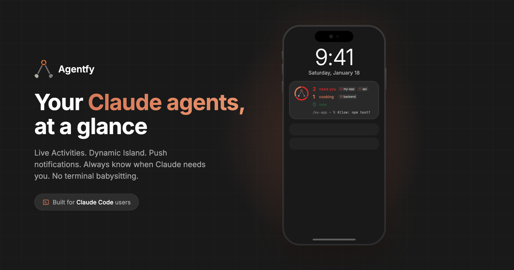

<div align="center">



# Agentfy — Claude Code plugin

**Monitor your [Claude Code](https://claude.com/claude-code) agents from your phone.**
Get an iPhone notification or Live Activity the moment an agent starts, stops, or needs you — no terminal babysitting.

[Download on the App Store](https://apps.apple.com/us/app/agentfy-ai-agent-monitor/id6757966311) · [getagentfy.com](https://www.getagentfy.com) · [What gets sent](#what-gets-sent--and-what-doesnt) · [Issues](https://github.com/ibrillantes/claude-code-plugin/issues)

</div>

---

This repo is both the **plugin marketplace** and the home of the open-source **`agentfy`** plugin. It's public on purpose: you can read exactly what leaves your machine in [`plugins/agentfy/hooks/send-event.sh`](plugins/agentfy/hooks/send-event.sh).

## Install

You'll need the [Agentfy iOS app](https://apps.apple.com/us/app/agentfy-ai-agent-monitor/id6757966311) (for your API token) and Claude Code **v2.1.143+**.

```bash
claude plugin marketplace add ibrillantes/claude-code-plugin
claude plugin install agentfy@agentfy --config api_token=<YOUR_TOKEN>
```

Then run `/reload-plugins` (or restart Claude Code) and send any message — your phone lights up.

> Prefer not to put your token in a command? Run `claude plugin install agentfy@agentfy` (no `--config`) and paste the token in the dialog — it's stored only in your keychain, never in shell history.

Grab `<YOUR_TOKEN>` from the app: **Settings → Configure Claude Code**.

## What it does

It registers Claude Code hooks for these lifecycle events and POSTs a small status payload to `https://webhook.getagentfy.com` on each one, authenticated with your per-user token:

`SessionStart` · `UserPromptSubmit` · `PreToolUse` · `PermissionRequest` · `Stop` · `Notification` · `PreCompact` · `SessionEnd`

| Event | What you see in the app |
| --- | --- |
| `SessionStart` | a new agent appears |
| `UserPromptSubmit`, `PreToolUse`, `PreCompact` | **cooking** (working) |
| `Stop`, `Notification`, `PermissionRequest` | **needs you** |
| `SessionEnd` | offline |

## What gets sent — and what doesn't

Everything is minimized **on your machine** before anything is sent. Read it yourself in [`send-event.sh`](plugins/agentfy/hooks/send-event.sh).

**Sent** (small metadata only):
- the event name, a session id, and your working directory → project name
- which tool is running and a short detail: the **command** (Bash), the **filename** (Edit/Write/Read), or the **search pattern** (Grep/Glob)
- permission prompts (e.g. `Allow: npm test?`)
- *if* "prompt preview" is on (default): the **first 30 characters** of your prompt — truncated locally, in the script, before the request is made

**Never sent:**
- your code or file contents — the body of an `Edit`/`Write` (`new_string`/`old_string`) is **stripped locally**; only the filename leaves your machine
- full prompts (only the optional 30-char preview, which you can turn off entirely)
- your conversation transcript

## Privacy & security

- **Token in the keychain.** Your API token is declared `sensitive`, so Claude Code stores it in your OS keychain — never in plaintext `settings.json`.
- **On-device truncation & minimization.** Prompt previews are cut to 30 chars and tool payloads are stripped of file contents before any network call. It's not a "trust us" promise — it's [code you can read](plugins/agentfy/hooks/send-event.sh).
- **Best-effort & non-blocking.** If the token isn't set, `jq`/`curl` are missing, or the network is down, the hook silently exits and never blocks Claude Code.
- **Open source.** This whole repo is public so you (and Claude Code, at install) can audit it.

## Configuration

Collected by Claude Code's plugin dialog when you enable the plugin (or via `--config`):

| Key | Type | Default | Notes |
| --- | --- | --- | --- |
| `api_token` | string (sensitive, required) | — | Your Agentfy token. Stored in the OS keychain. |
| `prompt_preview` | boolean | `true` | Send the first 30 chars of each prompt (trimmed locally). Set `false` to send no prompt text. |

## Rotating your token

If you regenerate your token in the app (Settings → Configure Claude Code → "Regenerate Token"), update the plugin so it stops sending the old one. Easiest — run the bundled command:

```
/agentfy:token <paste-your-new-token>
```

…then `/reload-plugins`. Equivalent alternatives:

- **Dialog:** `/plugin` → **Installed** → `agentfy` → **Configure** → paste the new token → Save
- **CLI:** `claude plugin install agentfy@agentfy --config api_token=<NEW_TOKEN>`

(Run `/agentfy:token` with no argument to see these steps inside Claude Code.)

## Updating the plugin

We bump the `version` on each release. Get the latest with:

```bash
claude plugin marketplace update agentfy && claude plugin update agentfy
```

…then `/reload-plugins`. (Or enable auto-update for this marketplace in `/plugin`.)

## Uninstall

```bash
claude plugin uninstall agentfy
claude plugin marketplace remove agentfy   # optional: also drop the marketplace
```

## Requirements

- Claude Code **v2.1.143+** (for the plugin config dialog)
- `jq` and `curl` on your `PATH` (standard on macOS; install via your package manager on Linux)
- macOS or Linux (the hook is a POSIX `sh` script; Windows isn't supported yet — use the in-app manual setup as a fallback)

## Testing locally

```bash
export AGENTFY_WEBHOOK_URL="http://127.0.0.1:8787"          # point at a local listener
export CLAUDE_PLUGIN_OPTION_API_TOKEN="<a-test-token>"
echo '{"session_id":"t","prompt":"a long prompt over thirty characters for sure"}' \
  | ./plugins/agentfy/hooks/send-event.sh UserPromptSubmit
```

## License

MIT — see [LICENSE](LICENSE).
